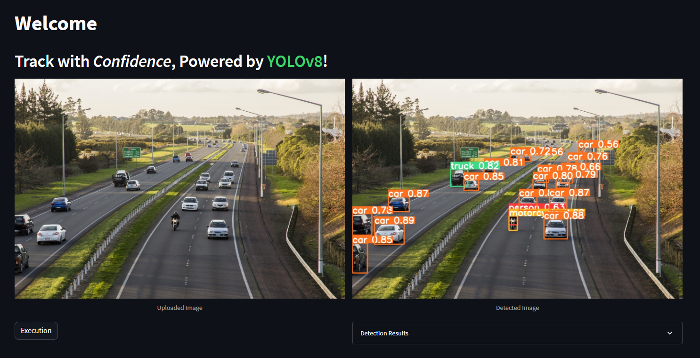
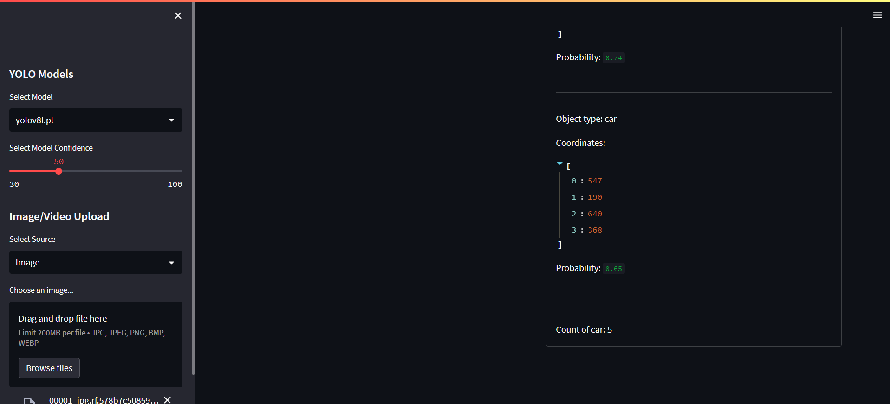

<div align="center">

# Vehicle Tracking in Challenging Scenarios using YOLOv8

  <p>
    <a align="center" href="https://ultralytics.com/yolov8" target="_blank">
      </a>
  </p>

<br>

<div>
 <a href="https://console.paperspace.com/github/ultralytics/ultralytics"></a>
    <a href="https://colab.research.google.com/github/ultralytics/ultralytics/blob/main/examples/tutorial.ipynb"></a>
    <a href="https://www.kaggle.com/ultralytics/yolov8"></a>
  </div>
  <br>
</div>

## Introduction

This is a semester-long coursework for the third year of the Bachelor of Software Engineering program at Yoobee Colleges in Auckland, focusing on advanced topics in software development and project management.

This repository contains code for a vehicle tracking system based on the [YOLOv8](https://github.com/ultralytics/ultralytics) object detection algorithm.The interface is powered by [Streamlit](https://github.com/streamlit/streamlit). The system is designed to work in challenging scenarios, such as low light conditions, occlusions, and fast motion.

## Features
- Feature 1: Object detection task.
- Feature 2: Multiple detection models. `yolov8n`, `yolov8s`, `yolov8m`, `yolov8l`, `yolov8x`
- Feature 3: Multiple input formats. `Image`, `Video`, `Webcam`
- Feature 4: Multiple Object Tracking and Counting.
  
---------

## Run online
You can use [This](https://vehicle-tracking-2023.streamlit.app/) link to try an online version on Streamlit.   

## Installation
### Create a virtual environment
```commandline
# for Windows
# create 
python -m venv myvenv

# activate
myvenv\Sripts\activate
```

### Clone repository
```commandline
git clone https://github.com/irinagetman1973/Vehicle-tracking-in-challenging-scenarios-using-YOLOv8.git
cd Vehicle-tracking-in-challenging-scenarios-using-YOLOv8
```

### Install packages
```commandline
# Streamlit dependencies
pip install streamlit

# YOLOv8 dependencies
pip install -e '.[dev]'
```
### Download Pre-trained YOLOv8 Detection Weights
Create a directory named `weights` and create a subdirectory named `detection` and save the downloaded YOLOv8 object detection weights inside this directory. The weight files can be downloaded from the table below.

| Model                                                                                | size<br><sup>(pixels) | mAP<sup>val<br>50-95 | Speed<br><sup>CPU ONNX<br>(ms) | Speed<br><sup>A100 TensorRT<br>(ms) | params<br><sup>(M) | FLOPs<br><sup>(B) |
| ------------------------------------------------------------------------------------ | --------------------- | -------------------- | ------------------------------ | ----------------------------------- | ------------------ | ----------------- |
| [YOLOv8n](https://github.com/ultralytics/assets/releases/download/v0.0.0/yolov8n.pt) | 640                   | 37.3                 | 80.4                           | 0.99                                | 3.2                | 8.7               |
| [YOLOv8s](https://github.com/ultralytics/assets/releases/download/v0.0.0/yolov8s.pt) | 640                   | 44.9                 | 128.4                          | 1.20                                | 11.2               | 28.6              |
| [YOLOv8m](https://github.com/ultralytics/assets/releases/download/v0.0.0/yolov8m.pt) | 640                   | 50.2                 | 234.7                          | 1.83                                | 25.9               | 78.9              |
| [YOLOv8l](https://github.com/ultralytics/assets/releases/download/v0.0.0/yolov8l.pt) | 640                   | 52.9                 | 375.2                          | 2.39                                | 43.7               | 165.2             |
| [YOLOv8x](https://github.com/ultralytics/assets/releases/download/v0.0.0/yolov8x.pt) | 640                   | 53.9                 | 479.1                          | 3.53                                | 68.2               | 257.8             |

## Custom-trained model
My custom-trained YOLOv8 model that I named DriveWatch was built using the following approach:**model = YOLO('yolov8n.yaml').load('yolov8n.pt')**. The model was trained on a dataset specifically curated for bright lighting conditions. The resulting model is fast and lightweight. Notably, during visual evaluation within the Streamlit app, the model exhibited better performance compared to the largest model available in similar bright lighting scenarios. A dataset of bright lighting images for testing models can be found [here](https://app.roboflow.com/ds/7QANGsAiXO?key=wLzv7PA1cy) 

## Run
```commandline
streamlit run app.py
```
Then will start the Streamlit server and open your web browser to the default Streamlit page automatically.


## Results




  
## Acknowledgement
- https://github.com/ultralytics/ultralytics
- https://github.com/streamlit/streamlit
- https://github.com/JackDance/YOLOv8-streamlit-app


